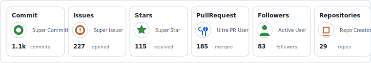
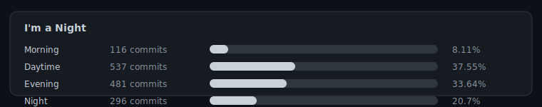
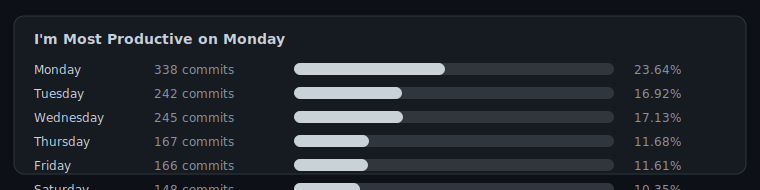
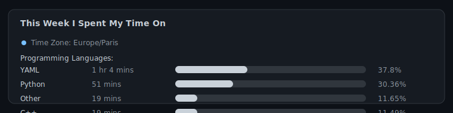

**4iKZ / README.md**

&nbsp;&nbsp;
&nbsp;&nbsp;
&nbsp;&nbsp;
&nbsp;&nbsp;

 
 

I'm a Java backend developer focused on the Spring ecosystem and Natural Language Processing (NLP). I enjoy building reliable services, optimizing databases, and exploring the intersection of backend systems and AI.

 

 
 

 
 

 

<table align="center">
  <tr>
    <td>

**Recent Activity:**

1. Merged PR #36 in APLA-Toolbox/pymapf
2. Merged PR #5 in awesome-github-pages-portfolios
3. Commented on #5 in awesome-github-pages-portfolios
4. Merged PR #104 in APLA-Toolbox/PythonPDDL
5. Merged PR #35 in APLA-Toolbox/pymapf

    </td>
  </tr>
</table>

 
 

 
 

 
 

